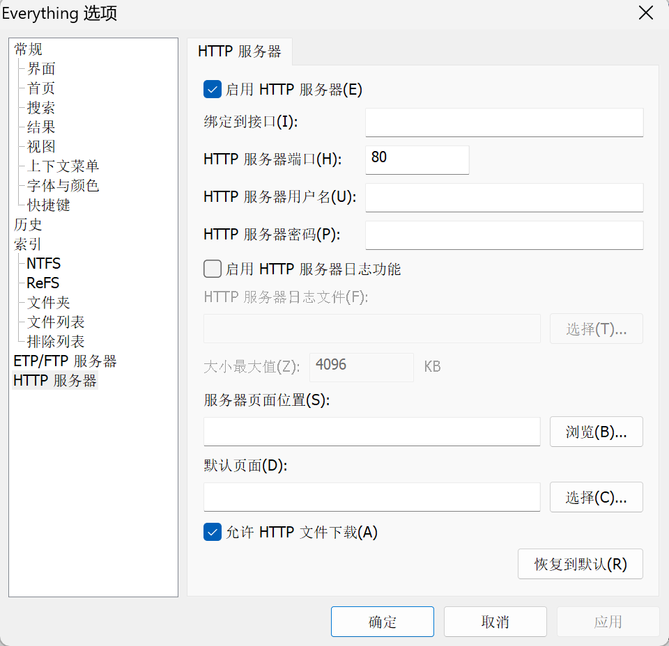

<h1>基于R和Julia的命令行指令</h1>

# 1. Installation

- 然后将`app`所在的路径，添加到环境变量，即可使用这些命令。

- 安装`R (>= 4.2.0)`，以及一些常用的R包（缺失的包请按照提醒安装）

- 安装`Julia`（缺失的包请按照提醒安装）


# 2. Example

## 2.1. `Everything` File Search in the Terminal

通过调用`Everything` HTTP API实现在命令行搜索文件，具体代码见[e.R](src/e.R)。

这也是如何将R语言打造成脚本语言的一个案例。

### 2.1.1. Requirements

- Everything Open HTTP Server
  

- R packages: `httr`, `rvest` and `dplyr`

### 2.1.2. Usage

```powershell
e "class CUG hydroMet"
# [1] "C:/Users/hydro/github/class2022_CUG_HydroMet"
# [2] "D:/Documents/OneDrive/水文气象学/class2022_CUG_HydroMet"
# [3] "E:/0-教学课件/class2023_CUG_HydroMet"
# [4] "X:/rpkgs/hydroTools.R/scripts/class_CUG_HydroMet" 
```

```powershell
e BEPS.jl
# [1] "Z:/GitHub/cug-hydro/BEPS.jl"
# [2] "Z:/GitHub/cug-hydro/BEPS.jl/src/BEPS.jl"
# [3] "Z:/DATA/Soil Moisture(2018-2022)/scripts/s2_BEPS.jl"
```

# 3. TODO

- [ ] 编写合并`excel类`的文件的脚本
- [ ] `csv编码格式`修改脚本
